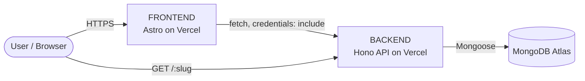

# HyperLink

**Short Links. Big Possibilities.**

HyperLink is a full-stack URL shortener. It turns long URLs into compact, shareable links, redirects visitors to the original destination, and tracks cumulative click performance for signed-in users through a dashboard and analytics view.

---

## Overview

Long URLs are hard to share, easy to mistype, and give no feedback on how often they are used. HyperLink addresses this by:

- Generating short links (with optional custom slugs) that redirect to the original URL.
- Counting clicks on every redirect.
- Letting signed-in users manage their links and view cumulative performance from a dashboard.

The repository contains two independent applications:

- **`FRONTEND/`** — a statically generated Astro site (landing page, auth pages, dashboard, analytics, settings).
- **`BACKEND/`** — a Hono API written in TypeScript, backed by MongoDB.

---

## Features

Implemented in the current codebase:

- **URL shortening** — create short links from long URLs, both anonymously (landing page) and while signed in.
- **Custom slugs** — provide your own slug (validated against a safe pattern) or let the server generate one.
- **Redirects** — short links resolve to the stored destination and increment a click counter.
- **Accounts** — register, sign in, and sign out with cookie-based sessions.
- **Dashboard** — create links, view total links/clicks, and manage a paginated list of your links (copy, open analytics, delete).
- **Cumulative analytics** — total links, total clicks, links with clicks, top links by click count, and per-link statistics.
- **Security measures** — bcrypt password hashing, httpOnly auth cookies, credentialed CORS restricted to configured origins, input validation (http/https URLs only), baseline security headers, and per-endpoint rate limiting.
- **Responsive UI** — mobile and desktop layouts with a dark/light theme.

Not implemented (see [Future Improvements](#future-improvements)): password reset, profile editing, social/OAuth login, historical click trends, and device/referrer/geolocation analytics.

---

## Tech Stack

| Layer | Technology |
| --- | --- |
| **Frontend** | Astro 7 (static output), TypeScript, Tailwind CSS v4 (via `@tailwindcss/vite`), plain TypeScript in component `<script>` tags |
| **Backend** | Hono 4, TypeScript, Bun (local runtime), `@hono/node-server` |
| **Database** | MongoDB Atlas via Mongoose 8 |
| **Authentication** | JWT access token + opaque refresh token stored in httpOnly cookies; `bcryptjs` for password hashing; `jsonwebtoken` for signing |
| **Deployment** | Vercel (frontend and backend as separate projects), MongoDB Atlas |

---

## Architecture

`FRONTEND` and `BACKEND` are two separate applications inside a single repository. They are deployed independently and communicate over HTTP with credentialed requests.



- The **frontend** is a static Astro build served from Vercel. All API calls go to the backend using the base URL from `PUBLIC_API_BASE_URL`, with `credentials: "include"` so the httpOnly auth cookies are sent.
- The **backend** is a Hono application that handles the API under `/api/*` and the short-link redirect at `/:slug`.
- The **database** is MongoDB Atlas, accessed through `MONGO_URL`.

---

## Project Structure

```text
HyperLink/
├── FRONTEND/            # Astro frontend (separate Vercel project)
│   ├── public/
│   ├── src/
│   │   ├── api/         # Typed API clients (auth, user, analytics, short URL)
│   │   ├── components/  # UI components (landing, dashboard, analytics, auth, layout, common)
│   │   ├── layouts/     # Astro layout
│   │   ├── pages/       # Routes: index, login, signup, dashboard, analytics, settings
│   │   ├── styles/      # Global CSS / theme tokens
│   │   ├── types/       # Shared TypeScript types
│   │   └── utils/       # Auth-state probe, helpers
│   ├── astro.config.mjs
│   └── package.json
├── BACKEND/             # Hono backend (separate Vercel project)
│   ├── src/
│   │   ├── config/      # Cookie/CORS config and MongoDB connection
│   │   ├── controller/  # Request handlers
│   │   ├── dao/         # Database access (Mongoose queries)
│   │   ├── middleware/  # Rate limiting and auth middleware
│   │   ├── models/      # Mongoose schemas (User, shortUrl, Session)
│   │   ├── routes/      # Hono route definitions
│   │   ├── scripts/     # Maintenance scripts (e.g. backfill)
│   │   ├── services/    # Business logic
│   │   ├── utils/       # Token helpers, error handling
│   │   ├── app.ts       # Hono application (default export)
│   │   └── server.ts    # Local Bun server entry
│   └── package.json
└── README.md
```

**Frontend directories of note**

- `src/pages` — file-based routes: `/`, `/login`, `/signup`, `/dashboard`, `/analytics`, `/settings`.
- `src/api` — the single place where backend endpoints are called.
- `src/components` — grouped by area: `landing`, `dashboard`, `analytics`, `auth`, `layout`, `common`, `cosmic`.

**Backend directories of note**

- `src/routes` — route definitions mounted in `src/app.ts`.
- `src/controller` → `src/services` → `src/dao` — layered request flow (controllers stay thin, business logic lives in services, database access in DAOs).
- `src/models` — Mongoose schemas.
- `src/app.ts` — the Hono app (no listener); `src/server.ts` starts the local HTTP server.

---

## Frontend Setup

Requires [Bun](https://bun.sh/) and Node.js `>=22.12.0`.

```bash
cd FRONTEND
bun install

# create a .env file (see Environment Variables)
echo "PUBLIC_API_BASE_URL=http://localhost:3000" > .env

bun run dev      # start the dev server (http://localhost:4321)
bun run build    # production build -> dist/
bun run preview  # preview the production build locally
```

| Script | Command | Purpose |
| --- | --- | --- |
| `bun run dev` | `astro dev` | Local dev server (default port `4321`) |
| `bun run build` | `astro build` | Static production build to `dist/` |
| `bun run preview` | `astro preview` | Preview the built site |

---

## Backend Setup

Requires [Bun](https://bun.sh/) and a MongoDB connection string.

```bash
cd BACKEND
bun install

# create a .env file (see Environment Variables)

bun run dev        # start the local server (http://localhost:3000)
bun run build      # type-check and compile TypeScript to dist/
bun run typecheck  # type-check only (tsc --noEmit)
```

| Script | Command | Purpose |
| --- | --- | --- |
| `bun run dev` | `bun --hot src/server.ts` | Local dev server with hot reload (`src/server.ts` loads `.env` and connects to MongoDB) |
| `bun run build` | `tsc` | Compile TypeScript to `dist/` |
| `bun run start` | `bun run dist/app.js` | Run the compiled application module |
| `bun run typecheck` | `tsc --noEmit` | Type-check without emitting files |

The Hono application itself lives in `src/app.ts` and is exported as the default export; it does not start a listener.

---

## Environment Variables

Only variables actually referenced by the code are listed. Store real values in `.env` locally and in the hosting provider's environment settings for deployments — never commit secrets.

### Frontend

| Variable | Description |
| --- | --- |
| `PUBLIC_API_BASE_URL` | Base URL of the backend API (inlined at build time). |

```bash
PUBLIC_API_BASE_URL=http://localhost:3000
```

### Backend

| Variable | Description |
| --- | --- |
| `MONGO_URL` | MongoDB Atlas connection string. |
| `JWT_SECRET` | Secret used to sign and verify access tokens. |
| `CORS_ORIGIN` | Comma-separated list of origins allowed to make credentialed requests. |
| `NODE_ENV` | Set to `production` in production (enables secure cookies, HSTS, and generic error messages). |
| `APP_URL` | Public base URL of the backend, used to build the returned short links (no trailing slash required). |

```bash
MONGO_URL=your_mongodb_connection_string
JWT_SECRET=your_jwt_secret
CORS_ORIGIN=http://localhost:4321
NODE_ENV=development
APP_URL=http://localhost:3000
```

---

## Authentication

Authentication is cookie-based. The frontend never reads or stores tokens; it relies on the browser sending httpOnly cookies.

- **Registration / login** validate input, hash the password with bcrypt, and create a short-lived access token plus a server-side session.
- **Two httpOnly cookies** are set:
  - `accessToken` — a signed JWT (short-lived, ~10 minutes), sent on every request.
  - `refreshToken` — an opaque random token (long-lived, ~30 days), sent only to `/api/auth`.
- Only a **hash** of the refresh token is stored server-side (in a `Session` document with a TTL index); the raw token is never persisted.
- **Refresh rotation** — when an authenticated request returns `401`, the frontend calls `POST /api/auth/refresh` once; the presented refresh token is invalidated and a new access/refresh pair is issued, and the original request is retried.
- **Logout** revokes only the current device's session and clears both cookies.
- Passwords are stored as bcrypt hashes. Login returns a single generic error for a wrong email or password (no account enumeration).

Cookies are `httpOnly`, `sameSite: "lax"` in development and `sameSite: "none"` with `secure: true` in production (required for cross-site requests between the separately hosted frontend and backend).

Not implemented: social/OAuth login, password reset, email verification, and multi-device session management UI.

---

## API

Base path: `/api`. Except where noted, endpoints require a valid session and operate only on the signed-in user's own links (ownership is enforced in the database queries).

### Authentication

| Method | Endpoint | Auth | Description |
| --- | --- | --- | --- |
| `POST` | `/api/auth/register` | No | Create an account (`name`, `email`, `password`) and start a session. |
| `POST` | `/api/auth/login` | No | Sign in with `email` and `password` and start a session. |
| `POST` | `/api/auth/refresh` | Cookie | Rotate the refresh session and issue a new token pair. |
| `POST` | `/api/auth/logout` | Cookie | Revoke the current session and clear the auth cookies. |

### URL Management

| Method | Endpoint | Auth | Description |
| --- | --- | --- | --- |
| `POST` | `/api/create` | Optional | Create a short URL from `{ url, slug? }`. Returns the short URL as plain text. Works anonymously; if a session is present, the link is owned by that user. |
| `GET` | `/api/urls` | Yes | Paginated list of the user's links (`page`, `limit`). |
| `GET` | `/api/urls/stats` | Yes | Dashboard totals: `totalLinks`, `totalClicks`. |
| `GET` | `/api/urls/overview` | Yes | Analytics totals: `totalLinks`, `totalClicks`, `linksWithClicks`. |
| `GET` | `/api/urls/top` | Yes | The user's top links by cumulative clicks (`limit`). |
| `GET` | `/api/urls/:id` | Yes | Cumulative analytics for one owned link. |
| `DELETE` | `/api/urls/:id` | Yes | Delete one owned link. |

### Redirect

| Method | Endpoint | Auth | Description |
| --- | --- | --- | --- |
| `GET` | `/:slug` | No | Resolve the short link, increment its click count, and redirect to the stored destination (or `404` if not found). |

Rate limiting is applied to the credential endpoints (`/api/auth/*`) and to link creation (`/api/create`). The limiter is in-memory and per-instance.

---

## Analytics

HyperLink tracks **cumulative** metrics only — there is no click-event history, because individual click timestamps are not stored.

Implemented:

- **Total links** — number of links owned by the user.
- **Total clicks** — sum of clicks across the user's links.
- **Links with clicks** — how many of the user's links have at least one click.
- **Top links** — the user's links ordered by cumulative click count.
- **Per-link statistics** — destination, slug, short URL, click count, and creation date for a single link.

Not implemented: historical/time-series click trends, unique visitors, device/browser analytics, referrer analytics, and geographic analytics.

---

## Deployment

The repository is deployed as **two separate Vercel projects** created from the same GitHub repository:

| Project | Root Directory | Output | Notes |
| --- | --- | --- | --- |
| Frontend | `FRONTEND` | Static site (`dist/`) | Astro static build; `PUBLIC_API_BASE_URL` is provided at build time. |
| Backend | `BACKEND` | Vercel Function | Hono application on the Node.js runtime; connects to MongoDB Atlas. |

- Both applications live in one repository but deploy independently, so each can be updated without redeploying the other.
- The backend reads its configuration entirely from environment variables (`MONGO_URL`, `JWT_SECRET`, `CORS_ORIGIN`, `NODE_ENV`, `APP_URL`).
- The backend uses Vercel's built-in Hono support and does not rely on a committed `vercel.json`.
- Production domains, secrets, and connection strings are configured in the hosting provider's settings and are intentionally not stored in the repository.

---

## Development Workflow

1. Run the backend (`cd BACKEND && bun run dev`) and the frontend (`cd FRONTEND && bun run dev`) locally.
2. Make and test changes.
3. Type-check the backend with `bun run typecheck` and build the frontend with `bun run build`.
4. Commit and push:
   ```bash
   git add .
   git commit -m "Describe the change"
   git push
   ```
5. Vercel picks up the push and redeploys the affected project(s).

---

## Screenshots

> Screenshots will be added here.

---

## Future Improvements

The following are **not implemented** and are listed only as potential enhancements:

- Password reset and email verification.
- Profile editing (name/email) and account deletion.
- Click-event history to enable time-series charts.
- Device, referrer, and geographic analytics; unique-visitor tracking.
- Custom/branded domains.
- A shared rate-limit store (e.g. Redis) for multi-instance deployments.

---

## Contributing

1. Fork the repository and create a feature branch (`git checkout -b feature/your-feature`).
2. Follow the existing project structure and conventions (layered backend; typed frontend API clients).
3. Run `bun run typecheck` in `BACKEND` and `bun run build` in `FRONTEND` before committing.
4. Open a pull request with a clear description of the change.

---

## License

This project is licensed under the **MIT License**. See [LICENSE](./LICENSE) for details.

---

## Author

**Pranjal Nishad**
